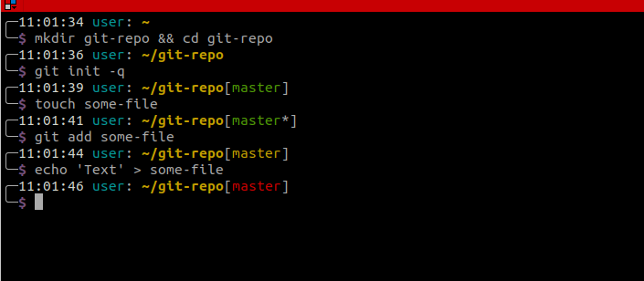
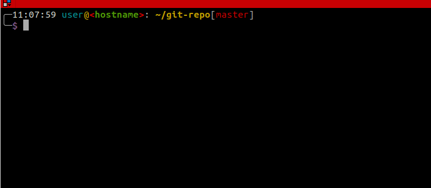

# Simple bash prompt

Clone the repo to your home folder:

```shell
cd ~
git clone https://github.com/HypeMC/bash-prompt.git .bash_prompt
```

Add the following to your `.bashrc`:

```shell
. ~/.bash_prompt/prompt.sh

PROMPT_COMMAND="__prompt $color_prompt"
```



With the hostname displayed:

```shell
. ~/.bash_prompt/prompt.sh

PROMPT_COMMAND="__prompt $color_prompt yes"
```


